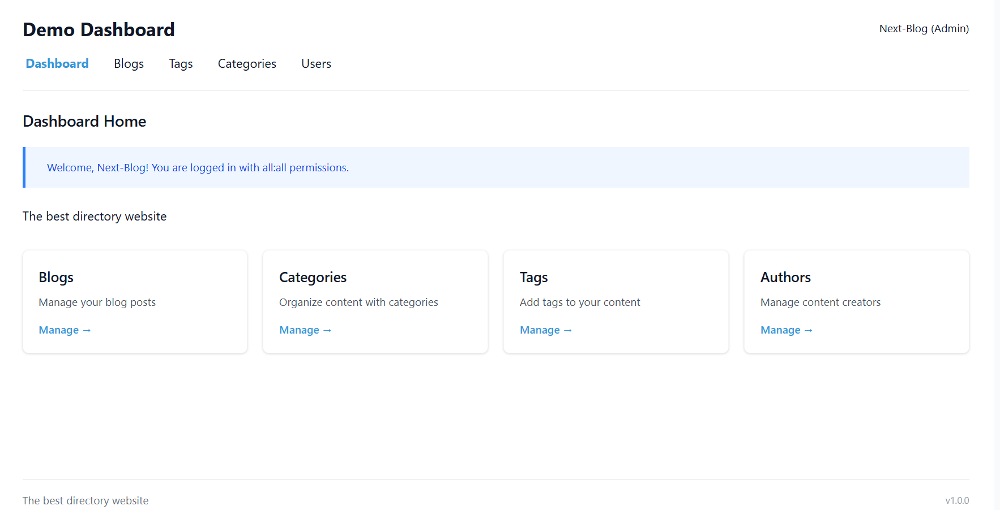

# Next-Blog: Enterprise-Grade Headless CMS & Plugin Platform for Next.js

<div align="center">
  <h3>The Most Extensible Content Management System for Next.js Applications</h3>
  <p>Build sophisticated content platforms with a powerful plugin architecture, media management, and enterprise features</p>
</div>

<div align="center">
  

  <h4 style="margin-top: 2px; color: #666; font-weight: 500;">
    <em>Professional Content Management Dashboard with Plugin Extensions</em>
  </h4>
</div>

## 🚀 Why Next-Blog?

Next-Blog isn't just another blogging tool – it's a **complete headless CMS platform** designed for modern Next.js
applications. Built with enterprise requirements in mind, it provides the flexibility of a headless CMS with the
simplicity of a drop-in solution.

### Key Differentiators

- **🔌 Advanced Plugin Architecture** - Extend every aspect with 60+ hook points
- **📦 Production-Ready Plugins** - 12+ built-in plugins for SEO, AI content, and more
- **🎨 Block-Based Rich Editor** - Modern content editing experience
- **☁️ Flexible Storage** - Local filesystem or S3-compatible cloud storage
- **🔐 Enterprise Security** - Role-based permissions and secure API endpoints
- **⚡ Optimized Performance** - Streaming uploads, efficient caching, O(1) hook lookups
- **🛠 Developer Experience** - Full TypeScript, plugin dev kit, comprehensive SDK

## 📋 Table of Contents

- [Features](#-features)
- [Architecture](#-architecture)
- [Quick Start](#-quick-start)
- [Plugin Ecosystem](#-plugin-ecosystem)
- [API Reference](#-api-reference)
- [Development](#-development)
- [Plugin Development](#-plugin-development)
- [Production Deployment](#-production-deployment)
- [Roadmap](#-roadmap)

## ✨ Features

### Core CMS Capabilities

#### Content Management

- **Rich Text Editor** - Block-based editor with Markdown support
- **Media Management** - Upload, organize, and manage images/files with streaming support
- **Categories & Tags** - Hierarchical content organization
- **Draft/Published States** - Complete publishing workflow
- **Metadata Support** - Custom fields and SEO metadata

#### User & Permission System

- **User Management** - Create and manage users with roles
- **Granular Permissions** - Entity-level permission controls
- **Session Management** - Secure authentication system
- **Role-Based Access** - Define custom roles and capabilities

#### Developer Features

- **RESTful API** - 40+ endpoints for complete CRUD operations
- **TypeScript First** - Full type safety across the entire stack
- **Database Support** - FileDB and MongoDB options
- **Storage Adapters** - Local filesystem or S3-compatible storage
- **Hook System** - Extend functionality at any point
- **Plugin SDK** - Comprehensive development toolkit

### Plugin System

The plugin architecture is the heart of Next-Blog's extensibility:

- **60+ Hook Points** - UI zones, lifecycle events, and data transformations
- **Client & Server Plugins** - Full-stack plugin capabilities
- **RPC Communication** - Seamless client-server plugin communication
- **Intent System** - UI communication layer for modals and dialogs
- **Plugin Isolation** - Scoped storage, cache, and settings per plugin

### Built-in Plugins

| Plugin                      | Description                      | Features                                            |
|-----------------------------|----------------------------------|-----------------------------------------------------|
| **SEO Sitemap**             | Automatic XML sitemap generation | Dynamic routes, priority settings, change frequency |
| **SEO RSS**                 | RSS feed generation              | Customizable feed format, categories support        |
| **SEO Robots**              | robots.txt management            | Crawl rules, sitemap references                     |
| **JSON-LD Structured Data** | Schema.org structured data       | Article, BlogPosting, Organization schemas          |
| **AI Blog Generator**       | AI-powered content creation      | OpenAI integration, content suggestions             |
| **SEO Analyzer**            | Real-time SEO optimization       | Keyword density, readability, meta analysis         |
| **Broken Link Checker**     | Link validation                  | Scheduled checks, automatic notifications           |
| **Permalink Manager**       | Custom URL patterns              | Redirects, slug customization                       |
| **System Update Manager**   | Plugin & core updates            | Automatic updates, version management               |

## 🏗 Architecture

Next-Blog is built as a **monorepo** with carefully separated concerns:

```
next-blog/
├── packages/
│   ├── core/              # Backend engine & API (@supergrowthai/core)
│   ├── dashboard/         # Admin UI components (@supergrowthai/dashboard)
│   ├── types/            # TypeScript type definitions (@supergrowthai/types)
│   ├── oneapi/           # HTTP routing with streaming (@supergrowthai/oneapi)
│   ├── plugin-dev-kit/   # Plugin development toolkit
│   ├── ui/               # Shared UI components
│   └── jsx-runtime/      # Custom JSX runtime for plugins
└── plugins/              # Built-in plugins
    ├── seo-sitemap/
    ├── ai-blog-generator/
    └── ... (12+ plugins)
```

### Technology Stack

- **Runtime**: Node.js with ESM modules
- **Framework**: Next.js App Router
- **Language**: TypeScript (strict mode)
- **Database**: MongoDB or FileDB
- **Storage**: Local filesystem or S3-compatible
- **Build**: Vite for packages, Bun for workspace
- **UI Framework**: Preact for dashboard, React for plugins

## 🚀 Quick Start

### Installation

```bash
npm install @supergrowthai/next-blog
# or
yarn add @supergrowthai/next-blog
# or
bun add @supergrowthai/next-blog
```

### Basic Setup

1. **Create the API route** at `app/api/next-blog/[...page]/route.ts`:

```typescript
import nextBlog, {FileDBAdapter} from "@supergrowthai/next-blog"
import path from 'path';

// File-based database (perfect for small to medium sites)
const dataPath = path.join(process.cwd(), "blog-data");
const dbProvider = async () => new FileDBAdapter(dataPath)

// Initialize Next-Blog with configuration
const {GET, POST} = nextBlog({
    db: dbProvider,
    config: {
        title: "My Blog",
        description: "Professional blog platform"
    }
})

export {GET, POST};
```

2. **Access your dashboard** at `/api/next-blog/dashboard`

### Production Setup

For production environments, you can use MongoDB and S3 storage. See the documentation for detailed configuration
options.

## 🔌 Plugin Ecosystem

### Installing Plugins

Plugins can be installed directly from the dashboard:

1. Navigate to **Plugins** → **Add New**
2. Enter the plugin URL or select from marketplace
3. Configure plugin settings
4. Activate the plugin

### Creating Custom Plugins

Next-Blog provides a complete plugin development experience:

```bash
# Create a new plugin with CLI
bunx create-next-blog-plugin plugins/my-plugin

# Navigate to plugin directory
cd plugins/my-plugin

# Start development server
npm run dev
```

#### Plugin Structure

```typescript
// src/index.ts - Plugin manifest
import {definePlugin} from '@supergrowthai/next-blog-plugin-dev-kit';

export default definePlugin({
    id: 'my-plugin',
    name: 'My Custom Plugin',
    version: '1.0.0',
    description: 'Extends Next-Blog functionality',
    permissions: ['blogs:read', 'blogs:write']
});

// src/client.tsx - Client-side hooks (React components)
import {defineClient} from '@supergrowthai/next-blog-plugin-dev-kit';
import {useState, useEffect} from '@supergrowthai/next-blog-plugin-dev-kit/client';

export default defineClient({
    hooks: {
        'dashboard-home:after': (sdk) => {
            const [data, setData] = useState(null);

            useEffect(() => {
                // Load data on mount
                loadData();
            }, []);

            return <div>My
            Widget < /div>;
        }
    }
});

// src/server.ts - Server-side hooks
import {defineServer} from '@supergrowthai/next-blog-plugin-dev-kit';

export default defineServer({
    hooks: {
        'blog:beforeCreate': async (sdk, payload) => {
            // Validate or modify blog data
            if (payload.title.length < 10) {
                throw new Error('Title too short');
            }
            return payload;
        }
    },
    rpcs: {
        'myPlugin:getData': async (sdk, request) => {
            return {data: 'response'};
        }
    }
});
```

### Available Hook Points

#### UI Extension Zones

- `dashboard-header` - Global header area
- `dashboard-home:before/after` - Dashboard homepage
- `blogs-list:before/after` - Blog listing pages
- `editor-sidebar-widget` - Blog editor sidebar
- `blog-create-form:before/after` - Creation forms
- `*-list-toolbar` - List page toolbars

#### Data Lifecycle Hooks

- `blog:beforeCreate/afterCreate` - Blog creation
- `blog:beforeUpdate/afterUpdate` - Blog updates
- `blog:beforeDelete/afterDelete` - Blog deletion
- `user:beforeCreate/afterCreate` - User management
- `media:beforeUpload/afterUpload` - Media handling

#### System Events

- `auth:beforeLogin/afterLogin` - Authentication
- `plugin:beforeInstall/afterInstall` - Plugin lifecycle
- `cron:5-minute/hourly/daily` - Scheduled tasks

## 📡 API Reference

Next-Blog provides a comprehensive RESTful API:

### Blog Endpoints

- `GET /api/next-blog/blogs` - List all blogs with pagination
- `GET /api/next-blog/blogs/:id` - Get specific blog
- `POST /api/next-blog/blogs/create` - Create new blog
- `POST /api/next-blog/blog/:id/update` - Update blog
- `POST /api/next-blog/blog/:id/delete` - Delete blog

### Media Endpoints

- `GET /api/next-blog/media` - List media files
- `POST /api/next-blog/media/upload/:id` - Stream upload files
- `POST /api/next-blog/media/:id/update` - Update media metadata
- `POST /api/next-blog/media/delete/:id` - Delete media

### User Management

- `GET /api/next-blog/users` - List users
- `POST /api/next-blog/users/create` - Create user
- `POST /api/next-blog/user/:id/update` - Update user
- `POST /api/next-blog/auth/login` - User login
- `POST /api/next-blog/auth/logout` - User logout

### Plugin APIs

- `GET /api/next-blog/plugins` - List installed plugins
- `POST /api/next-blog/plugins/create` - Install plugin
- `POST /api/next-blog/plugins/rpc/:method` - Execute plugin RPC

## 💾 Database Support

Next-Blog supports both FileDB (JSON-based) for development/small sites and MongoDB for production deployments.
Configuration is handled through the database provider in your route setup.

## 🛠 Development

### Setting Up Development Environment

```bash
# Clone the repository
git clone https://github.com/yourusername/next-blog.git
cd next-blog

# Install dependencies
bun install

# Build all packages
bun run build

# Start development mode
bun run dev

# Run test application
bun run dev:test
```

### Workspace Commands

```bash
# Type checking across all packages
bun run typecheck

# Build specific package
cd packages/core && bun run build

# Watch mode for package development
cd packages/dashboard && bun run dev

# Run plugin development server
cd plugins/my-plugin && npm run dev
```

### Project Structure Guidelines

- **Types First** - Update `@supergrowthai/types` before implementation
- **No Backward Compatibility** - Clean code without legacy support
- **Fail Fast** - Explicit errors over silent failures
- **Minimal Abstractions** - Direct, purpose-built solutions
- **ESM Modules** - Use `.js` extensions in imports

## 🚀 Production Deployment

### Environment Variables

```env
# Database (MongoDB)
MONGODB_URI=mongodb+srv://...
MONGODB_DB_NAME=nextblog

# Storage (S3)
S3_BUCKET=my-blog-media
S3_REGION=us-east-1
S3_ACCESS_KEY=AKIA...
S3_SECRET_KEY=...

# Security
SESSION_SECRET=random-32-char-string
ADMIN_EMAIL=admin@example.com
```

### Performance Optimization

- **CDN Integration** - Serve media through CloudFront/Cloudflare
- **Database Indexing** - Automatic indexes for common queries
- **Caching Strategy** - Built-in cache with Redis support
- **Streaming Uploads** - Efficient large file handling
- **Lazy Loading** - Plugins loaded on-demand

### Security Features

- **CSRF Protection** - Token-based request validation
- **XSS Prevention** - Content sanitization
- **SQL Injection Protection** - Parameterized queries
- **Rate Limiting** - API endpoint protection
- **Audit Logging** - Track all admin actions

## 🗺 Roadmap

### Currently Implemented

- ✅ Complete plugin architecture with 60+ hooks
- ✅ Media management system with streaming uploads
- ✅ Intent system for UI communication
- ✅ 12+ production plugins (SEO suite, AI generator, etc.)
- ✅ Storage adapters (Local & S3)
- ✅ Rich text block-based editor
- ✅ User management with permissions
- ✅ Categories and tags system
- ✅ Plugin development kit and CLI tools

### Planned Features

- 📅 Additional plugin marketplace
- 📅 Enhanced analytics dashboard
- 📅 Multi-language content support
- 📅 Advanced content scheduling
- 📅 Real-time collaboration features

## 🤝 Contributing

We welcome contributions! Next-Blog is built by the community, for the community.

### How to Contribute

1. **Report Issues** - Found a bug? Let us know!
2. **Suggest Features** - Have an idea? Open a discussion!
3. **Submit PRs** - Fix bugs or add features
4. **Create Plugins** - Extend the ecosystem
5. **Improve Docs** - Help others get started
6. **Share Feedback** - Your experience matters

### Development Philosophy

- **Clean Code** - No hacks, no workarounds
- **Type Safety** - Full TypeScript coverage
- **Performance** - Measure and optimize
- **User Experience** - Intuitive and powerful
- **Documentation** - Clear and comprehensive

## 📖 Documentation

- **[Plugin Development Guide](AI_PLUGIN_DEVELOPMENT_GUIDE.md)** - Complete plugin creation tutorial
- **[Architecture Overview](PROJECT_MAP.md)** - System design and patterns

## 🌟 Why Choose Next-Blog?

### For Developers

- **Modern Stack** - Latest Next.js, TypeScript, and React
- **Extensible** - Plugin architecture for any requirement
- **Well-Documented** - Comprehensive guides and examples
- **Type-Safe** - Full TypeScript with strict mode
- **Developer Tools** - CLI, dev kit, hot reload

### For Content Teams

- **Intuitive UI** - Clean, modern dashboard
- **Rich Editing** - Block-based editor with preview
- **Media Management** - Drag-drop uploads, organization
- **SEO Tools** - Built-in optimization features
- **Workflow Support** - Draft, review, publish states

### For Enterprises

- **Scalable** - From blogs to enterprise portals
- **Secure** - Enterprise-grade security features
- **Customizable** - White-label ready
- **Multi-tenant** - Support multiple sites
- **Support Available** - Professional support options

## Star History

[](https://www.star-history.com/#captadexp/next-blog&type=date&logscale&legend=top-left)

## 🔗 Links

- **NPM**: [@supergrowthai/next-blog](https://www.npmjs.com/package/@supergrowthai/next-blog)

## 📝 License

MIT License - feel free to use Next-Blog in personal and commercial projects.

---

<div align="center">
  <p>Built with ❤️ by the Next-Blog community</p>
  <p><strong>Transform your Next.js application into a powerful content platform today!</strong></p>
</div>