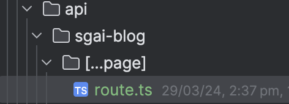

# Next-Blog

**Elevate your Next.js project with seamless blogging functionality.**

Next-Blog is designed to integrate a blogging platform into your Next.js application effortlessly, akin to the simplicity of integrating NextAuth today.

**Currently, Next-Blog is a work in progress and we're excited to invite collaborators to join us in this journey.** Whether you're interested in coding, documentation, design, or testing, we welcome contributions of all kinds to make Next-Blog robust and user-friendly.



### Quick Start

To add Next-Blog to your project, follow these simple steps:

1. **Install Next-Blog**

   First, ensure you have Next.js set up. Then, install Next-Blog by adding it to your project dependencies.

2. **Update Your Route Configuration**

   In your `route.ts`, integrate Next-Blog as shown:

   ```typescript
   import nextBlog from "@supergrowthai/next-blog"

   const { GET, POST } = nextBlog();

   export { GET, POST };
   ```

3. **Configure Rewrites in next.config.js**

   Define a rewrite in your `next.config.js` to specify where your blog posts are routed:

   ```javascript
   const config = {
       rewrite() {
           return [
               {
                   source: "/blog/:slug*",
                   destination: "/api/sgai-blog/:slug*",
               },
           ];
       },
   };
   ```

### Roadmap

Here are the next steps on our journey to enhance Next-Blog:

- [x] Project initialization.
- [ ] Add a simple database adapter (SQLite/JSON file).
- [ ] Implement internal dashboard pages for managing posts, complete with an editor.
- [ ] Introduce configuration options for managing pages, tags, and filters.
- [ ] Create a sample theme to kickstart your blog aesthetics.
- [ ] And more - we're open to suggestions!

### Get Involved

We're looking for contributors to help develop features, write documentation, design user interfaces, and more. If you're passionate about making content creation accessible and straightforward for Next.js developers, we'd love to hear from you.

**Join us in shaping the future of blogging in Next.js. Together, we can build something amazing.**

---

This version aims to be more engaging, inviting, and clear in its instructions and call for collaboration. Feel free to adjust the language to better match the tone and style of your project or community!
